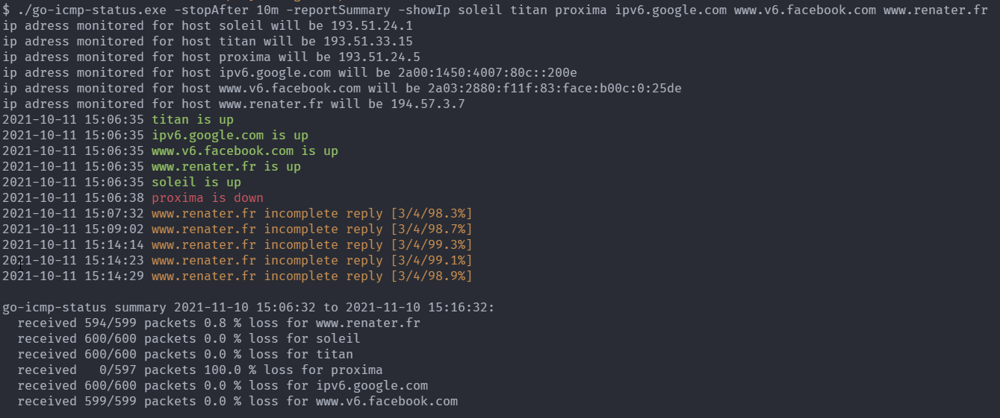

# go-icmp-status

Very simple tool that keep sending icmp packet to a list of ipv4 or ipv6 hosts, and display flip/flap icmp status changes, and packet loss.

* Need root rights on linux for sending icmp packets ( or sudo, or chown root `binary` , chmod u+s `binary` after build )

* Dependencies [github.com/digineo/go-ping](https://github.com/digineo/go-ping) + monitor + fathi/color

* Go build

```shell
> git clone https://github.com/thc2cat/go-icmp-status 
> cd go-icmp-status 
> go mod tidy 
> go build`
```

* Colored output ( red/green/yellow ) with timestamp

* fast way of monitoring a list of hosts :

```shell
> cat fqdnhostslist.txt | xargs go-icmp-status -pingInterval 30s
```

* Exemple of continuous monitoring (after `mtr` check and text paste):


